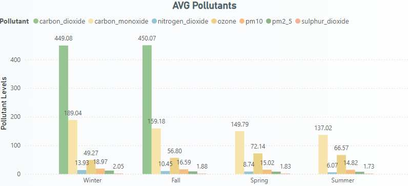
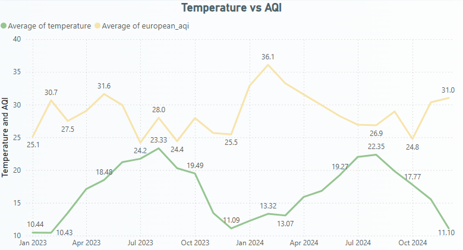
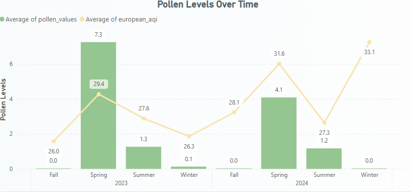
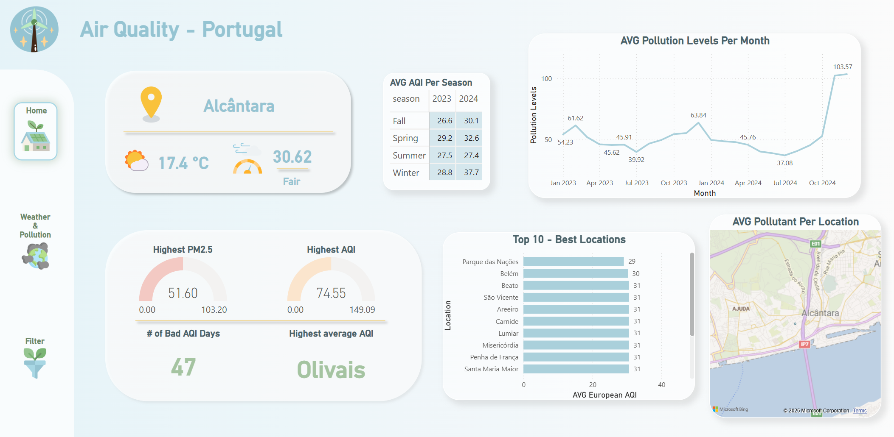
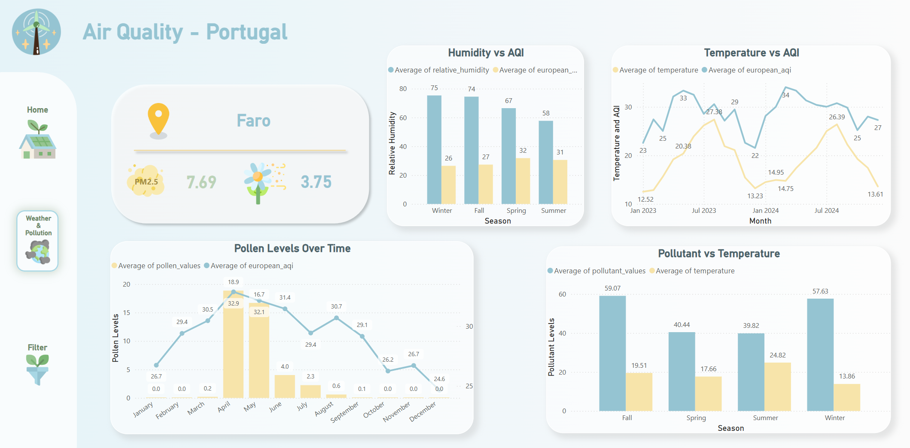

# **Air Quality Analysis in Portugal** 🌱


# 📝 Overview

This project analyzes air quality across Portugal, focusing on pollutants like AQI, PM2.5, PM10, CO2, and weather-related factors such as temperature, humidity, and pollen levels. The analysis provides insights into air quality trends, seasonal patterns, and the relationship between weather variables and air quality. The project is visualized through an interactive Power BI dashboard to help understand the effects of air pollution at different levels of granularity (district, municipality, parish).

# 🔑 Key Findings

### **Pollution Levels by Season:**



- **Winter and Fall:** Higher levels of CO2 and CO due to heating sources and fossil fuel emissions.

- **Spring and Summer:** Air quality tends to improve with fewer pollutants, although fluctuations still occur.


### **Temperature vs. AQI:**



- Temperature follows a clear seasonal pattern with lower temperatures in Winter and higher temperatures in Summer.

- AQI fluctuates more inconsistently with temperature, suggesting that other environmental factors may have a stronger influence on air quality than temperature alone.

### **Pollen and AQI:**



- Pollen levels show strong seasonality, peaking in Spring and remaining low in Fall/Winter.

- However, pollen levels don’t have a direct correlation with the AQI trends, suggesting other pollutants have a more significant impact on air quality.

# Data Sources 🌱

- **API:** Air quality data was collected through an environmental data API.

- **Web Scraping:** The list of locations was sourced from Wikipedia.

- **Population Data:** For population analysis, data was retrieved from the National Statistics Institute (2023).

# Methodology 🔬

**Data Cleaning:**
- The data was cleaned and pre-processed by splitting datetime columns, adding holidays, and categorizing times of day. Outliers were kept due to their importance in capturing pollution spikes.

**Database Creation (SQL):**
- After cleaning, the data was structured and stored in a SQL database to enable better performance and organization of hourly records across multiple locations.

**Hypothesis Testing:**
- **Time of Day vs. Pollution:** The Kruskal-Wallis test was used to determine significant differences in pollution levels across different times of the day.

- **Holidays vs. PM2.5:** The Mann-Whitney U test showed significant differences in PM2.5 levels between holidays and regular days.

# Dashboard 🌞
### Air Quality


### Weather and Pollution


The results of this analysis are visualized through an interactive **Power BI dashboard**, which includes a **filter panel** that allows users to explore data by location, season, time of day, and more — enabling a deeper, customizable analysis experience.
- Monthly AQI Trends

- Temperature and AQI Correlation

- Pollen Levels and AQI Comparison

- Seasonal Pollution Levels  

# Future Work 🔮
- **Real-time Predictions:** Integrating real-time predictions for air quality.

- **Spatial Granularity:** Improving spatial granularity down to the neighborhood level.

- **Alert System:** Adding a system to alert vulnerable groups about pollution spikes.

- **Public Health & School Planning:** Exploring potential applications of the analysis for public health and school planning.

## **Presentation Slides** 📸

- Feel free to access the presentation online through the [following link](https://www.canva.com/design/DAGj-SE8WGI/u4T68vb_gNZk-BYSgBV4IA/view?utm_content=DAGj-SE8WGI&utm_campaign=designshare&utm_medium=link2&utm_source=uniquelinks&utlId=hc18b3f163c), or download it directly from the repository. <br>

# How to Use 📥
### **Clone the repository:**

```bash
  git clone https://github.com/yourusername/Air_Quality_Analysis_Project.git
```


**Navigate to the Power BI dashboard:**

- Open the air_quality_dashboard.pbix file to view the interactive dashboard.

- Explore the various charts and insights generated from the air quality data.


# Contributing 🤝
Feel free to open an issue or submit a pull request if you'd like to contribute to the project! 🌟

## **License** 📄
- This project is licensed under the MIT License - see the [LICENSE file](https://github.com/BeatrizAVeiga/Air_Quality_Analysis_Project/blob/main/LICENSE) for details. ⚖️